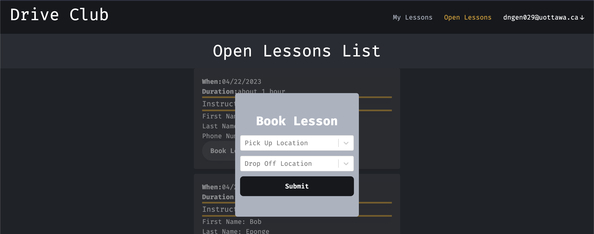

# Driving Lesson Scheduler App

## Production App Link
- [https://drive-club.vercel.app/](https://drive-club.vercel.app/)
- **Note**: Please contact me for access to the production app, since I'm the only admin

## Tech Stack
- NextJS
- Tailwindcss
- tRPC
- prisma
- postgreSQL (Supabase)

## Current Features
- As an administrator:
    - register student accounts with their email
    - register driving instructors with their email
    - register new administrators with their email
    - view and delete students/instructors/admin accounts
    - view all posted driving lessons

- As an instructor:
    - create new driving lessons with a start and end datetime (max duration of 2h)
    - view status of every lesson posted, including student information if they book the lesson
    - Delete your posted driving lesson, if no student has booked it yet
    - Cancel your posted driving lesson, if the lesson was booked

- As a student:
    - View your currently booked driving lessons with the instructor's information and cancel status
    - View and book open driving lessons by adding a pickup and dropOff location (uses Google Maps API)
    - Cancel your booked driving lesson

- General
    - Passwordless Login

## Developer environment setup
**Note**: This project has 2 main third party dependecies (SendGrid and GoogleMapsAPI) and the app won't run without these or equivalent services
- Clone the repo
- Populate the `.env.example` file
- Run `npm install` to install dependecies
- Run `npx prisma db push` to push the prisma db schema to your database
- Create your own admin account through your database with SQL ie. insert a new row into the `User` table with a **valid** email
- Run `npm run dev` to start your dev environment

## Screenshots
### Admin View
 
### Student View
 
 
### Magic SignIn Link Email
 

 ## Next Steps/Features to be implemtented
 - Pagination or Infinite Scrolling
 - Filtering Driving lessons on start date, duration, instructor
 - Editing pickup and dropOff location once a lesson is booked
 - Email notifications for cancelled and booked lessons for students and instructors
 - As a student, adding instructors as favorite 
 - Support for multiple driving schools
