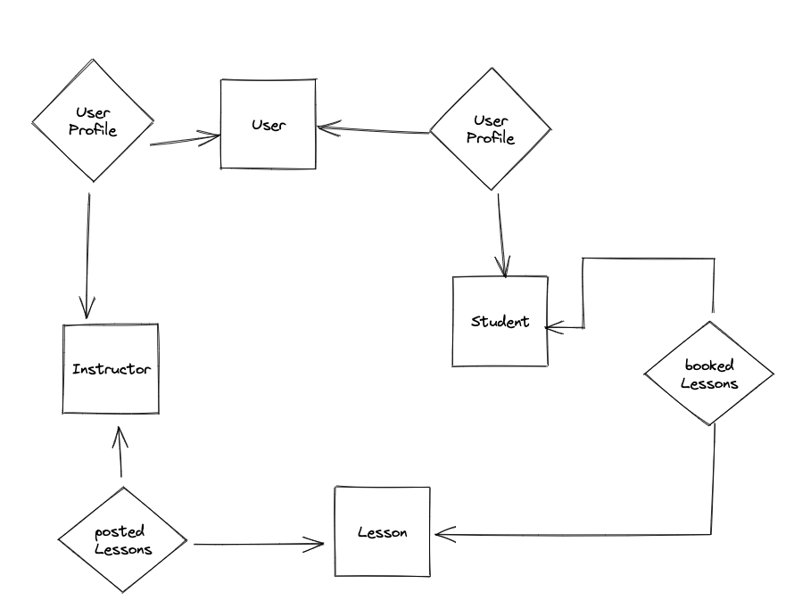

# DB Design

## ER Diagram


## Domain Entities

### User
- Represents any type of system user, can be a student, instructor or administrator
- Attributes
```
    id            String       @id @default(cuid())
    email         String?      @unique
    role          Role         @default(ADMIN)
    emailVerified DateTime?

```
- Relationships:
    -  One to one with Student
    -  One to one with Intructor
### Instructor
- Represents a driving instructor
- Attributes:
```
    id            String   @id @default(uuid())
    firstName     String
    lastName      String
    userId        String
    userProfile   User     @relation(fields: [userId], references: [id], onDelete: Cascade)
    phoneNumber   String
    postedLessons Lesson[]

```

###  Student
- Represents a student
- Attributes:
```
    firstName     String
    lastName      String
    userId        String
    userProfile   User     @relation(fields: [userId], references: [id], onDelete: Cascade)
    phoneNumber   String
    bookedLessons Lesson[]
```

###  Lesson
- Represents a driving lesson
- Attributes:
```
    id              String     @id @default(uuid())
    startAt         DateTime   @db.Timestamptz(3)
    endAt           DateTime   @db.Timestamptz(3)
    instructorId    String
    instructor      Instructor @relation(fields: [instructorId], references: [id], onDelete: Cascade)
    student         Student?   @relation(fields: [studentId], references: [id], onDelete: SetNull)
    studentId       String?
    booked          Boolean    @default(false)
    canceled        Boolean    @default(false)
    pickUpLocation  String?
    dropOffLocation String?
    createdAt       DateTime   @default(now())
    updatedAt       DateTime   @updatedAt
}
```

